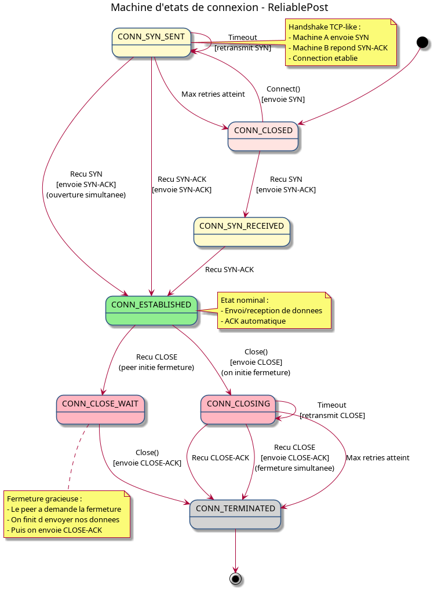

# Connect / IsConnected / Close

`Connect` - Établit une connexion avec la machine distante
`IsConnected` - Vérifie si la connexion est active
`Close` - Ferme la connexion proprement

## SYNOPSIS

```cpp
#include "reliablepost.h"

bool Connect();
bool IsConnected();
void Close();
```

## DESCRIPTION

### Connect

`Connect` établit une connexion avec la machine distante configurée lors de la création du `ReliablePost`. Utilise un handshake de type TCP (SYN/SYN-ACK).

**Comportement :**
- Bloquant : attend que la connexion soit établie
- Retransmission automatique du SYN en cas de perte
- Timeout après `CONNECT_RETRIES` tentatives

### IsConnected

`IsConnected` vérifie si la connexion est actuellement établie et utilisable pour l'envoi de données.

**Comportement :**
- Non-bloquant
- Retourne `false` si le peer a initié la fermeture

### Close

`Close` ferme la connexion de manière gracieuse. Attend que tous les messages en attente soient acquittés avant d'envoyer la demande de fermeture.

**Comportement :**
- Bloquant : attend l'acquittement de fermeture
- Envoie CLOSE, attend CLOSE-ACK
- Gère la fermeture simultanée des deux côtés

## VALEUR DE RETOUR

### Connect

- **`true`** : Connexion établie avec succès
- **`false`** : Échec (timeout, machine distante non disponible)

### IsConnected

- **`true`** : Connexion active, envoi possible
- **`false`** : Non connecté ou peer a fermé

### Close

Aucune valeur de retour.

## MACHINE D'ÉTATS



### États

| État | Description |
|------|-------------|
| `CONN_CLOSED` | Pas de connexion |
| `CONN_SYN_SENT` | SYN envoyé, attente de réponse |
| `CONN_ESTABLISHED` | Connexion active |
| `CONN_CLOSE_WAIT` | Le peer veut fermer |
| `CONN_CLOSING` | Fermeture en cours |
| `CONN_TERMINATED` | Connexion fermée |

## PROTOCOLE DE CONNEXION

### Établissement (handshake)

```
Machine A                    Machine B
    |-------- SYN ------------>|
    |<------- SYN-ACK ---------|
    |      ESTABLISHED         |
```

### Fermeture gracieuse

```
Machine A                    Machine B
    |-------- CLOSE ---------->|
    |<------- CLOSE-ACK -------|
    |      TERMINATED          |
```

### Fermeture simultanée

Si les deux machines appellent `Close()` en même temps :

```
Machine A                    Machine B
    |-------- CLOSE ---------->|
    |<------- CLOSE -----------|
    |-------- CLOSE-ACK ------>|
    |<------- CLOSE-ACK -------|
    |      TERMINATED          |
```

## TIMEOUTS

| Paramètre | Valeur | Description |
|-----------|--------|-------------|
| `CONNECT_TEMPO` | 500000 ticks | Délai entre retransmissions SYN |
| `CONNECT_RETRIES` | 1000 | Nombre max de tentatives |
| `TEMPO` | 10000 ticks | Délai pour CLOSE |

## NOTES

- **Ordre de lancement** : Les deux machines peuvent être lancées dans n'importe quel ordre grâce aux retransmissions
- **Délai** : Prévoir ~2 secondes pour lancer la seconde machine
- **Robustesse** : Fonctionne même avec perte de paquets (`-l 0.5`)

## VOIR AUSSI

- [Vue d'ensemble](./Network.md) - Introduction au réseau
- [Transmission fiable](./ReliableTransmission.md) - SendReliable/ReceiveReliable
