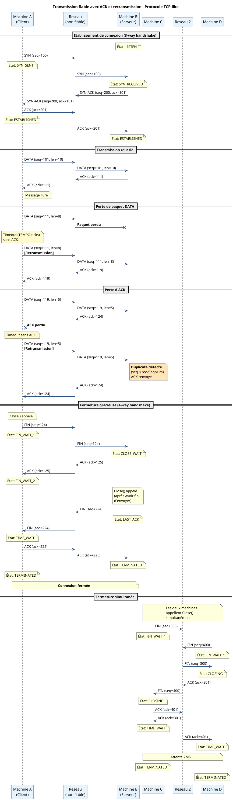
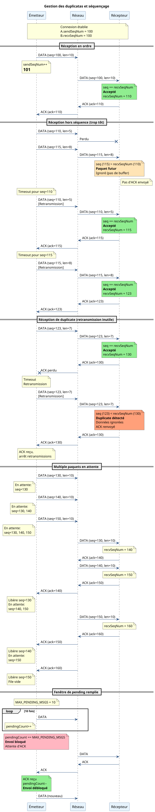

# Transmission fiable - SendReliable / ReceiveReliable

Cette page documente les mécanismes de transmission fiable implémentés dans NachOS ReliablePost.

## Vue d'ensemble

La transmission fiable garantit que les messages envoyés arrivent à destination malgré les pertes de paquets du réseau. Le protocole utilise :

- **Numéros de séquence** : Identification unique de chaque paquet
- **Acquittements (ACK)** : Confirmation de réception
- **Retransmission sur timeout** : Renvoi automatique en cas de perte
- **Détection de duplicatas** : Élimination des retransmissions inutiles

## Diagrammes de séquence

### Transmission complète



### Gestion des paquets



## Mécanismes de fiabilité

### 1. Numéros de séquence

Chaque paquet DATA a un numéro de séquence unique :

```cpp
uint32_t sendSeqNum;    // Prochain numéro à envoyer
uint32_t recvSeqNum;    // Prochain numéro attendu
```

**Règles :**
- `sendSeqNum` incrémenté après chaque envoi
- `recvSeqNum` incrémenté après chaque réception en ordre
- Numéro initial généré avec un hash du temps

### 2. Acquittements (ACK)

Chaque paquet DATA reçu en ordre génère un ACK :

```cpp
void SendACK() {
    SendControlMessage(MSG_ACK, sendSeqNum, recvSeqNum);
}
```

**Comportement du ACK :**
- `ackNum` = `recvSeqNum` (prochain octet attendu)
- Cumulative : ACK N confirme tous les paquets < N
- Duplicatas : ACK renvoyé même pour les paquets déjà reçus

### 3. Retransmission sur timeout

Thread de retransmission qui vérifie périodiquement les paquets non acquittés :

```cpp
void RetransmissionLoop() {
    while (true) {
        lock->Acquire();
        
        for (each pending message) {
            if (not acked && timeout expired) {
                if (attempts < MAX_RETRANSMISSIONS) {
                    Retransmit(msg);
                    msg->attempts++;
                } else {
                    // Abandon après MAX_RETRANSMISSIONS
                    SetState(CONN_TERMINATED);
                }
            }
        }
        
        lock->Release();
        Sleep(TEMPO / 2);
    }
}
```

**Paramètres de timeout :**
```cpp
#define TEMPO 10000                 // Timeout en ticks
#define MAX_RETRANSMISSIONS 100     // Tentatives max
```

### 4. Détection de duplicatas

À la réception d'un paquet DATA :

```cpp
void HandleDATA(header, payload) {
    if (header->seqNum == recvSeqNum) {
        // Paquet en ordre : accepter
        recvSeqNum++;
        EnqueueData(payload);
        SendACK();
    } 
    else if (header->seqNum < recvSeqNum) {
        // Duplicate : ignorer les données, renvoyer ACK
        SendACK();
    } 
    else {
        // Paquet futur : ignorer (pas de buffer)
        // Pas d'ACK envoyé
    }
}
```

**États des paquets :**

| Condition           | Interprétation             | Action               |
|---------------------|----------------------------|----------------------|
| `seq == recvSeqNum` | Paquet attendu             | Accepter, ACK        |
| `seq < recvSeqNum`  | Duplicate (retransmission) | Ignorer, ACK         |
| `seq > recvSeqNum`  | Paquet futur (hors ordre)  | Ignorer complètement |

## Gestion des messages en attente

### Structure PendingMessage

```cpp
struct PendingMessage {
    long long sentTime;             // Timestamp d'envoi
    uint32_t seqNum;                // Numéro de séquence
    int attempts;                   // Nombre de tentatives
    uint16_t dataLen;               // Taille des données
    MessageType type;               // Type de message
    uint8_t flags;                  // Flags (ACTIVE, ACKED)
    uint8_t pendingFlags;           // Flags du message
    char data[MAX_RELIABLE_DATA];   // Données
};
```

### File d'attente

```cpp
PendingMessage pending[MAX_PENDING_MSGS];  // 10 slots
int pendingCount;                          // Nombre de messages en attente
```

**Contrôle de flux :**
- `SendReliable()` bloque si `pendingCount >= MAX_PENDING_MSGS`
- Libération d'un slot sur réception d'ACK
- Condition variable `sendCond` pour synchronisation

### Cycle de vie d'un message

1. **Envoi** : Ajout à `pending[]`, `flags |= FLAG_ACTIVE`
2. **Retransmission** : Si timeout et `!(flags & FLAG_ACKED)`
3. **ACK reçu** : `flags |= FLAG_ACKED`, `flags &= ~FLAG_ACTIVE`
4. **Libération** : Slot disponible, `pendingCount--`

## Fragmentation de messages

Messages longs (> `MAX_RELIABLE_DATA`) découpés en chunks :

```cpp
void SendReliable(msg, length) {
    remaining = length;
    offset = 0;
    
    while (remaining > 0) {
        chunkSize = min(remaining, MAX_RELIABLE_DATA);
        
        if (remaining > chunkSize) {
            flags = FLAG_MORE_FRAGMENTS;
        } else {
            flags = FLAG_END_OF_MESSAGE;
        }
        
        SendChunk(msg + offset, chunkSize, flags);
        
        offset += chunkSize;
        remaining -= chunkSize;
    }
}
```

**Flags de fragmentation :**
- `FLAG_MORE_FRAGMENTS` : Ce n'est pas le dernier fragment
- `FLAG_END_OF_MESSAGE` : Dernier fragment du message

**Réassemblage :**
```cpp
void ReceiveReliable(buffer, maxLength) {
    totalReceived = 0;
    
    while (true) {
        chunk = GetNextChunk();
        
        memcpy(buffer + totalReceived, chunk->data, chunk->length);
        totalReceived += chunk->length;
        
        if (chunk->flags & FLAG_END_OF_MESSAGE) {
            break;  // Message complet
        }
    }
    
    return totalReceived;
}
```

## Comparaison avec TCP

| Aspect              | NachOS ReliablePost     | TCP                            |
|---------------------|-------------------------|--------------------------------|
| Numéros de séquence | Oui                     | Oui                            |
| ACK cumulatifs      | Oui                     | Oui                            |
| Retransmission      | Sur timeout fixe        | Sur timeout adaptatif (RTO)    |
| Fenêtre d'envoi     | 10 messages max         | Dynamique (congestion control) |
| Buffer réception    | Pas de réordonnancement | Buffer de réordonnancement     |
| Fragmentation       | Automatique             | Segmentation MSS               |

## Voir aussi

- [Gestion de connexion](./ConnectionManagement.md) - Connect/Close
- [Vue d'ensemble](./Network.md) - Introduction au réseau
- [Machine à états](./connection_state_machine.png) - États de connexion

## Auteurs

Alioune Badara DIENE
Antoine

## Dernière révision

21 Jan 2026